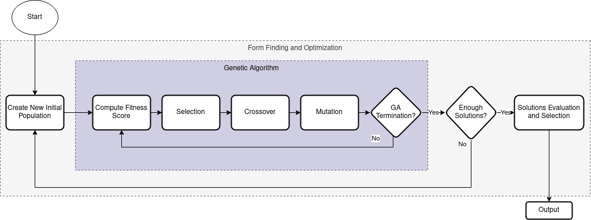
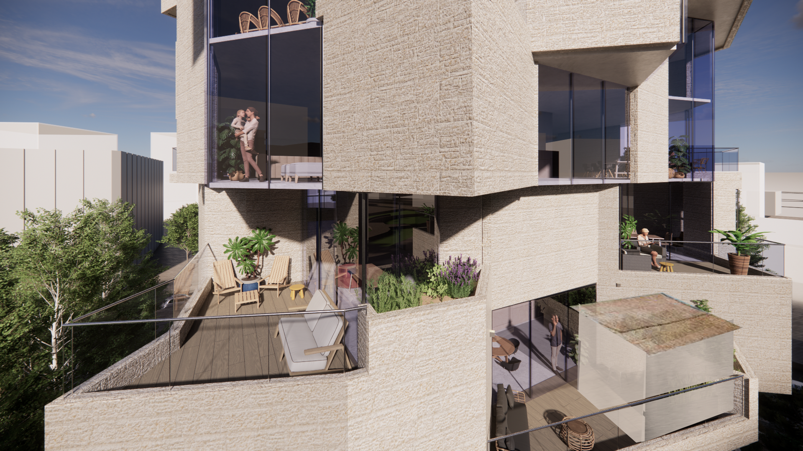

# Sukkah Balcony Optimizer

This project uses a genetic algorithm to optimize the design of Sukkah balconies in accordance with Jewish Halacha law. The algorithm generates an array of squares to find the maximum possible Sukkah balconies that adhere to the religious code.

## Process Overview

The diagram below provides an overview of the solution-finding process:



## Initial Floor Settings

The optimization process begins with an initial floor setting defined by points. The minimum and maximum location of solution points is demonstrated bellow:


## Solution Example

The genetic algorithm generates a variety of solutions. Here is an example of one such solution:


## Building Example

The solution is made out of an array of floors. Here is an example of how a solution looks in 3D:


## Rendered Examples

The following images provide rendered examples of buildings that have been optimized using the Sukkah Balcony Optimizer. These examples demonstrate the potential of this tool to generate complex designs, suggesting a contemporary style of residential buildings.




## Getting Started

These instructions will guide you on how to install and run the Sukkah Balcony Optimizer on your local machine.

### Prerequisites

The following Python libraries are required to run the code:

- numpy
- pygad
- shapely

### Installation

1. Clone the repository or download the code.
2. Install the required dependencies using pip:

```bash
pip install numpy pygad shapely
```

## Configuration

You can modify the parameters of the genetic algorithm to suit your needs.

- In `main.py`, you can change the number of generated solutions. By default, 200 solutions are generated.
- In `functions.py`, you can modify other parameters within the `main` function.

## Usage

### Running the Optimization

To run the optimization code, use the following command:

```bash
python main.py
```

### Evaluating the Results

To count the number of balconies and their size in a given solution, use the following command:

```bash
python evaluate.py [filename]
```

To generate a CSV file with the performance of all the generated solutions, use the following command:

```bash
python evaluate_folder.py
```

### Converting Solutions

To convert a single solution to Python code that can be executed in Rhino 3D, use the following command:

```bash
python convert_to_rhino.py [filename]
```

## Contributing

We welcome contributions to the Sukkah Balcony Optimizer. Please feel free to submit a pull request or open an issue to discuss your ideas.

## License

This project is licensed under the MIT License. See the [LICENSE](LICENSE) file for details.